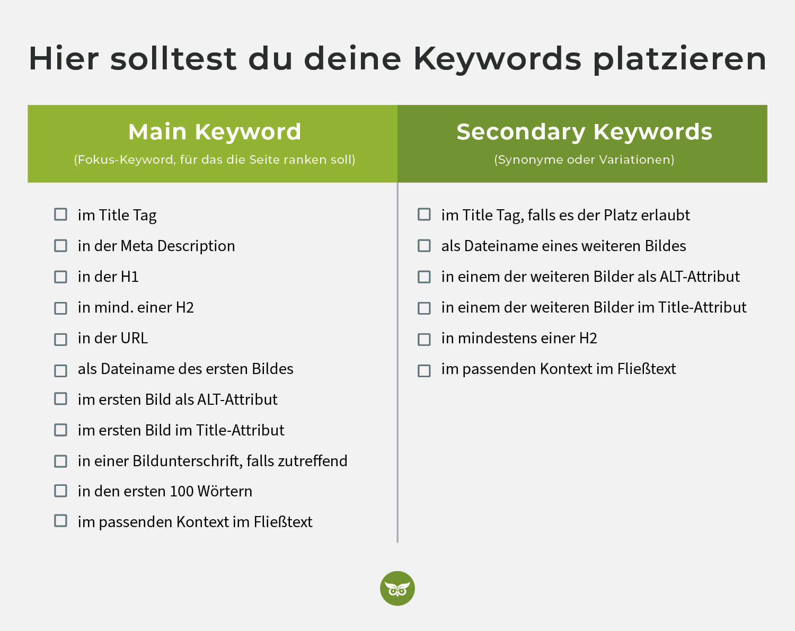

# SEO

* SEO steht für "Search Engine Optimization" (Suchmaschinenoptimierung) und bezeichnet die Praxis, eine Website so zu gestalten und zu verbessern, dass sie in den organischen (nicht bezahlten) Suchergebnissen von Suchmaschinen besser platziert wird. 

* Hauptziel von SEO ist es, die Sichtbarkeit einer Website in den Suchergebnissen zu erhöhen und damit mehr qualifizierten Traffic auf die Website zu lenken.

* Es gibt verschiedene Aspekte der Suchmaschinenoptimierung, die darauf abzielen, den Suchalgorithmus zu verstehen und zu beeinflussen, damit die Seite als relevant und qualitativ hochwertig betrachtet wird. 

# SEO Maßnahmen 

Sind Maßnahmen um die Sichtbarkeit einer Website in den organischen (nicht bezahlten) Suchergebnissen von Suchmaschinen zu verbessern. 

1. Keyword-Recherche und -Optimierung:

    * Identifikation relevanter Suchbegriffe (Keywords), die mit dem Inhalt der Website zusammenhängen.
    Integration dieser Keywords in den Seitentitel, Meta-Beschreibungen, Überschriften, Textinhalte und URLs.

2. Qualitative Maßnahmen:

    * Bereitstellung von qualitativ hochwertigen, relevanten und einzigartigen Inhalten, die die Bedürfnisse der Zielgruppe erfüllen.
    Regelmäßige Aktualisierung und Erweiterung von Inhalten, um die Aktualität zu gewährleisten.

3. On-Page-Optimierung:

    * Strukturierung der Webseite mit klaren Hierarchien und benutzerfreundlichen URLs.
    Verwendung von Header-Tags (H1, H2, H3) für eine sinnvolle Gliederung von Inhalten.
    Optimierung von Bildern mit aussagekräftigen Alt-Texten.

4. Technische SEO:

    * Sicherstellung schneller Ladezeiten der Webseite.
    Implementierung von sitemap.xml und robots.txt für eine bessere Indexierung durch Suchmaschinen.

5. Backlink-Building:

    * Vermeidung von schädlichen oder irrelevanten Backlinks, um Ranking-Probleme zu vermeiden.

6. Social Media Integration

    * Nutzung von Social-Media-Plattformen, um die Reichweite zu erhöhen und potenzielle Besucher anzusprechen.

7. Analyse und Monitoring

    * Einsatz von Webanalysetools wie Google Analytics, um den Traffic, das Nutzerverhalten und den Erfolg der SEO-Maßnahmen zu überwachen.

Suchbegriffe stellen die Verbindung zwischen den Nutzer*innen der Suchmaschine und der Seite bzw. den Inhalten dar, die explizit spezifische Antworten liefern sollen. Das Ziel ist es, über diese Suchbegriffe organischen Traffic zu generieren.

Keywords spielen in der OffPage- und OnPage-Optimierung eine wichtige Rolle. Da der Google-Algorithmus mehr und mehr Zusammenhänge erkennt, sollte der Fokus hier nicht auf der Quantität liegen. Keyword-Stuffing wird von Google als Verstoß geahndet und sollte deshalb nicht Teil der SEO-Strategie sein.

Stattdessen ist es wichtig, Schlüsselwörter möglichst natürlich zu platzieren, sodass User*innen und Suchmaschine wissen, worum es auf der Seite geht. Wenn die Suchintention genau getroffen und das Fokus-Keywords zudem an prominenten Stellen (Title Tag, H1-Überschrift etc.) eingebunden wird, steigen die Chancen auf Seite-1-Rankings signifikant.

## Starke Ranking-Signale für deinen Content
Suchbegriffe sollten an den folgenden prominenten Stellen eingebaut werden:

Main Keyword im Title Tag
Main Keyword in der H1-Überschrift
Main Keyword im erster Absatz (erste 100 Wörter)
Main Keyword in der URL (sorgt mit dafür, dass wir einen Backlink mit relevantem Ankertext bekommen, wenn die URL verlinkt wird.)

## Mittlere Ranking-Signale
Die folgenden Positionen sind deutlich weniger wichtig, aber verdeutlichen trotzdem die Relevanz:

Keywords und Variationen in den HTML-Überschriften von H2 bis H6
Keywords und Variationen im Fließtext
Main Keyword als ALT-Attribut des ersten Bildes (nachträgliche Optimierung ist in der Regel sinnlos)
Main Keyword als Dateiname des ersten Bildes (nachträgliche Optimierung ist in der Regel sinnlos)

## Schwache Ranking-Signale
Main Keyword in der Meta Description (trotzdem essentiell, da Google sonst eine eigene Meta-Beschreibung generiert)
Keywords mit strong in fett markiert
Keywords mit italic in kursiv markiert
Keywords in strukturierten Daten (JSON LD oder Microdata)
Main Keyword als Title-Attribut des ersten Bildes (nachträgliche Optimierung ist in der Regel sinnlos)
Keywords und Variationen in den Meta-Daten aller weiteren Bilder

 
