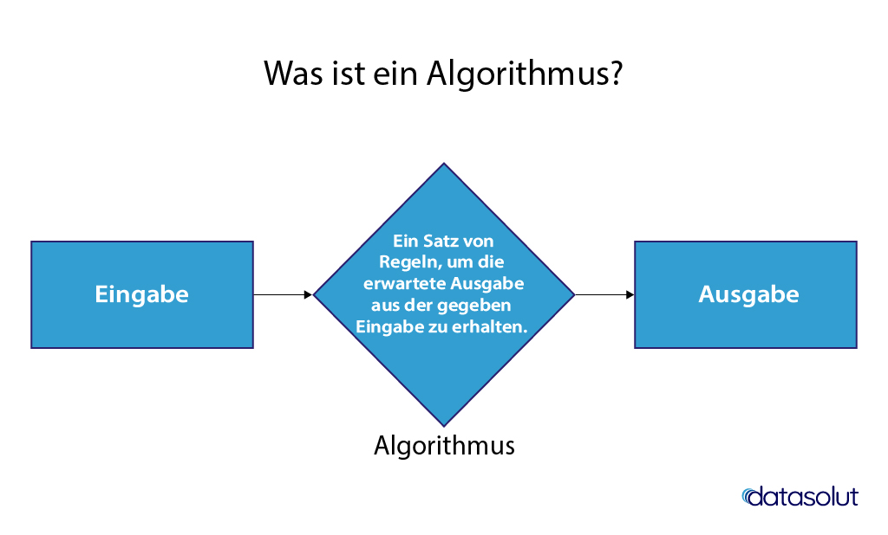
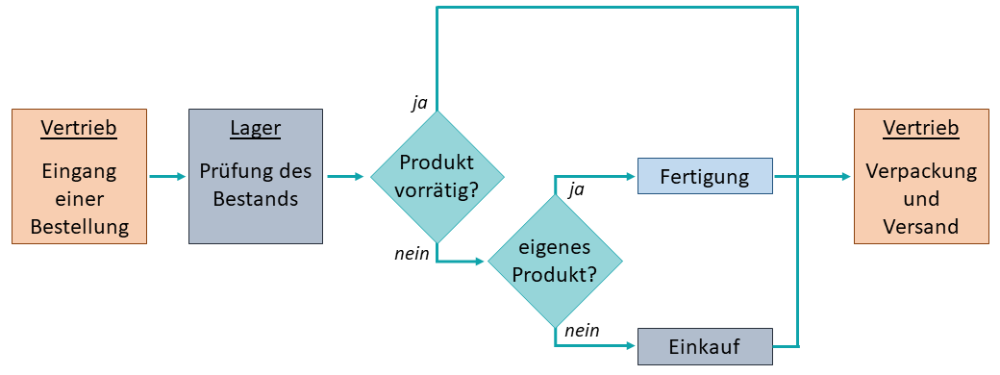
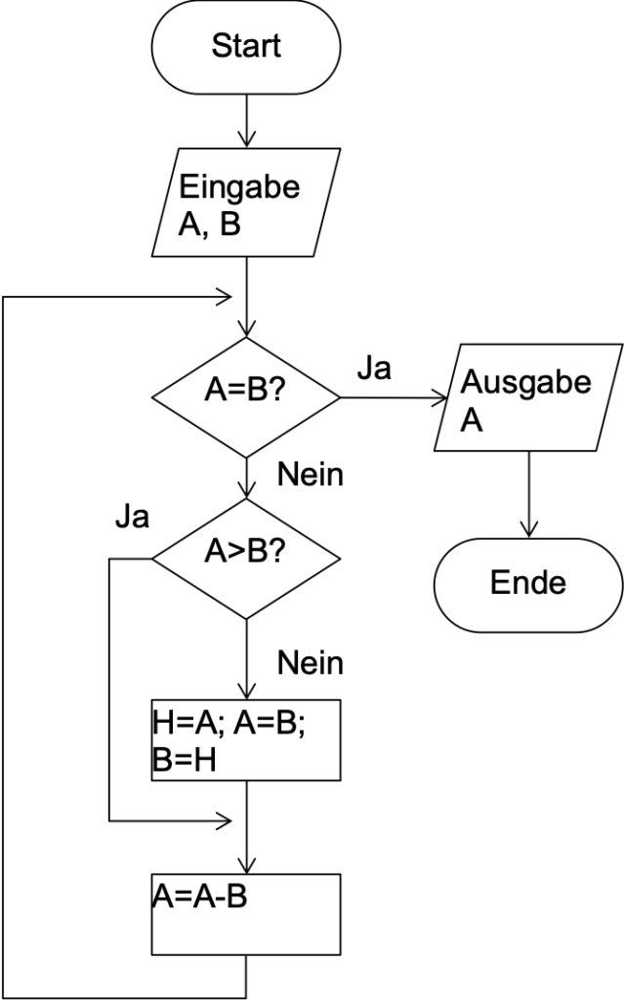
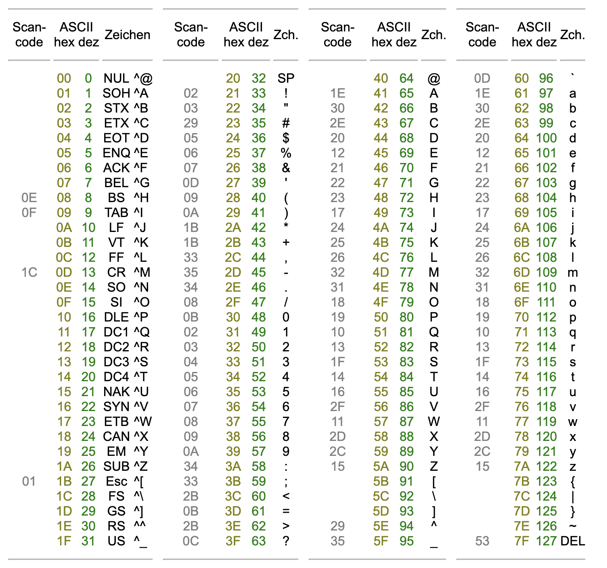

# Kapitel 1

# Grundlagen Informatik

- Informatik befasst sich mit der Verarbeitung von Informationen mithilfe von Computern.
- Es umfasst die Entwicklung von Software, die Konzeption von Algorithmen, Gestaltung von Datenstrukturen, die Analyse von Systemen und vieles mehr.
- Der Begriff Informatik setzt sich aus den beiden Wörtern "Information" und "Automatik" zusammen, also Automatisierung von Informationsprozessen.

**Die Frage die sich oft stellt was macht ein Informatiker?**

Informatiker beschäftigt sich damit, wie Probleme gut, effizient und automatisiert gelöst werden können.
Wobei die die Verarbeitung und Automatisierung vom Computer übernommen wird, muss der Mensch eine strukturierte und präzise Beschreibung der Problemlösung definieren.

**Was können Probleme sein**

- Computerprobleme gibt es in verschiedenen Varianten; einige sind einfach, andere sind schwierig.
- Das Sortierproblem ist ein einfaches Beispiel. Es erfordert, eine Liste von Zahlen in aufsteigender Reihenfolge zu arrangieren.
- Selbst ein kleiner Computer kann eine Million Zahlen recht schnell sortieren.
- Im Gegensatz dazu steht ein Zeitplanungsproblem. Angenommen, Sie müssen einen Stundenplan für die gesamte Universität erstellen.
- Dieser Stundenplan muss vernünftige Einschränkungen erfüllen, wie zum Beispiel, dass keine zwei Kurse zur gleichen Zeit im selben Raum stattfinden dürfen.
- Das Zeitplanungsproblem scheint viel schwieriger zu sein als das Sortierproblem.
- Selbst mit einem Supercomputer könnte die Suche nach dem besten Zeitplan Jahrhunderte dauern, wenn Sie nur tausend Kurse haben.

## Teilbereiche der Informatik

1. Theoretische Informatik: Beschäftigt sich mit abstrakten Aspekten von Algorithmen, Berechenbarkeit und Komplexitätstheorie.
2. Praktische Informatik: Umfasst die Anwendung von Informatikprinzipien zur Lösung realer Probleme, einschließlich Softwareentwicklung, Datenbankdesign, Netzwerke und mehr.
3. Technische Informatik: Konzentriert sich auf die Hardwarekomponenten von Computern, wie Prozessoren, Speicher und Peripheriegeräte.
4. Angewandte Informatik: Betrachtet die Anwendung von Informatik in anderen Wissenschafts- und Ingenieursdisziplinen, wie zum Beispiel Bioinformatik, Geoinformatik oder Medizinische Informatik.

## Alan Turing

- Alan Turing war ein britischer Mathematiker, Logiker und Kryptoanalytiker.
- Er lebte von 1912 bis 1954.
- Erfinder der Turing-Maschine, Grundlage für die Computerwissenschaft.

## Algorithmus

- Ein Algorithmus ist eine Reihe von klaren Anweisungen, die in einer bestimmten Reihenfolge befolgt werden, um ein bestimmtes Ergebnis zu erzielen.
- In der Welt der Computer wird ein Algorithmus verwendet, um ein Problem zu lösen oder eine Aufgabe auszuführen, indem er dem Computer sagt, welche Schritte er befolgen soll.

## Algorithmus - Beispiel Tee Kochen

1. Bring eine Tasse Wasser zum Kochen.
2. Lege einen Teebeutel in die Tasse.
3. Gieße das kochende Wasser über den Teebeutel in die Tasse.
4. Lass den Tee ziehen für die empfohlene Zeit (zum Beispiel 3 Minuten).
5. Entferne den Teebeutel.
6. Füge Zucker oder Milch hinzu, wenn gewünscht.
7. Rühre um, um den Zucker aufzulösen.
8. Lass den Tee kurz abkühlen, bevor du ihn trinkst.

## Definition Algorithmus



## Wie wird ein Algorithmus notiert?

### 1. Pseudocode:
Pseudocode ist eine informelle Beschreibung eines Algorithmus mit Elementen aus einer Programmiersprache, aber ohne strenge Syntax. Es ist weniger formal als echter Programmcode und erleichtert das Verständnis.

### 2. Flussdiagramm:
Ein Flussdiagramm ist eine grafische Darstellung eines Algorithmus. Es verwendet Symbole wie Rechtecke, Rauten und Pfeile, um die Schritte und Entscheidungen darzustellen.

### 3. Programmcode:
Der Algorithmus kann direkt in einer Programmiersprache geschrieben werden, wenn eine konkrete Implementierung benötigt wird.

### 4. Natürliche Sprache:
In einigen Fällen wird ein Algorithmus einfach in natürlicher Sprache erklärt. Das ist eher informell und weniger strukturiert, aber es kann ausreichen, um den grundlegenden Ablauf zu beschreiben.

## Flussdiagramm



## Flussdiagramm - Pseudocode



## Programmcode

```javascript
function findMaxElement(arr) {
    let maxElement = arr[0];

    for (let i = 1; i < arr.length; i++) {
        if (arr[i] > maxElement) {
            maxElement = arr[i];
        }
    }

    return maxElement;
}
```


## Informatik (eng: Computer Science)

* Solving Problems
* Computational Thinking
* Denken wie ein Computer

* **Algoirthmen**:

Input -> Verarbeitung -> Output

Computer kennen nur 0 und 1 und somit können sie auch nur Kommunizieren
also wie können wir einen Computer sagen was er tun soll?

* Mensch:

0 1 2 3 4 5 6 7 8 9 --> Dezimal

* Computer:

0 1 --> \\(Binär_2\\)

0 1 2 3 4 5 6 7 8 --> \\(Oktal_8\\)

0 1 2 3 4 5 6 7 8 9 A B C D E F --> \\(Hexadezimal_{16}\\)

* Gruppen von Bits sind Bytes:

Werte bereich eines Bytes: 

- Decimal \\(0_{10}\\) bis \\(255_{10}\\)
- Hexadezimal \\(00_{16}\\) bis \\(FF_{16}\\)
- Binär \\(00000000_{2}\\) bis \\(11111111_{2}\\)

Datein sind Container für lange Bytes:


\begin{aligned}
&\text{-}&& \text{Kilo} &&&& =1.000=\color{red}{10^3}  \\\\
&\text{-}&& \text{Mega} &&&& =1.000.000=\color{red}{10^6}  \\\\
&\text{-}&& \text{Giga} &&&& =1.000.000.000=\color{red}{10^9}  \\\\
&\text{-}&& \text{Tera} &&&& =1.000.000.000.000=\color{red}{10^{12}}  \\\\
&\text{-}&& \text{Peta} &&&& =1.000.000.000.000.000=\color{red}{10^{15}}  \\\\
&\text{-}&& \text{Exa} &&&&  =1.000.000.000.000.000.000=\color{red}{10^{18}}\\\\
\end{aligned}

Nun gut aber wie können wie Buchstaben anzeigen?

# ASCII Zeichensatz

Der ASCII-Zeichensatz (ASCII steht für "American Standard Code for Information Interchange") ist ein standardisierter Satz von Zeichen, der zur Repräsentation von Texten in Computern und anderen Geräten verwendet wird. Er wurde entwickelt, um eine einheitliche Methode zum Codieren von Zeichen unabhängig von der verwendeten Hardware oder Software zu schaffen. Der ASCII-Zeichensatz besteht aus 128 Zeichen, die in sieben-Bit-Codes dargestellt werden (0 bis 127). Ursprünglich war ASCII auf 7-Bit beschränkt, später wurde jedoch eine 8-Bit-Erweiterung namens "Extended ASCII" eingeführt, die zusätzliche Zeichen für verschiedene Sprachen und Sonderzeichen ermöglichte.

1. **Grundlegende Zeichen (0-31 und 127):** Die ersten 32 und das 127. Zeichen (DEL) sind nicht-druckbare Steuerzeichen, die für die Steuerung von Peripheriegeräten in der Anfangszeit der Computer verwendet wurden.

2. **Druckbare Zeichen (32-126):** Dieser Bereich enthält die druckbaren Zeichen, die für die Darstellung von Texten verwendet werden. Dazu gehören Buchstaben, Zahlen, Satzzeichen und einige spezielle Zeichen.

3. **Erweiterter ASCII (128-255):** Die 8-Bit-Erweiterung fügte weitere Zeichen hinzu, darunter diakritische Zeichen, Währungssymbole und verschiedene spezielle Symbole. Die genaue Belegung kann je nach Sprache variieren (z.B., ISO-8859-1 für westeuropäische Sprachen).

ASCII-Codes werden verwendet, um Zeichen in binärer Form darzustellen, wobei jedem Zeichen ein eindeutiger 7- oder 8-Bit-Code zugeordnet ist. Zum Beispiel ist der ASCII-Code für das kleine 'a' 97, für das kleine 'b' 98 und so weiter.

ASCII spielt eine grundlegende Rolle in der Textverarbeitung, Datenkommunikation und Programmierung. Mit der Verbreitung von Unicode, der eine viel breitere Zeichenmenge unterstützt, wird ASCII in vielen modernen Anwendungen durch Unicode ersetzt, um die Unterstützung verschiedener Schriften und Schriftsysteme zu gewährleisten.


* **American Standard Code for Information Interchange** (ASCII,
bzw. ANSI X3.4) ist der am weitersten verbreitete Zeichen-Code.
* Bereich zwischen 0 und 255 verfügbar.

 

## Binärsystem

* Im Binärsystem stehen einem nur die Ziffern 0 und 1 zur Verfügung

* Die Ziffern einer Binärzahl stellen also die Koeffizienten der Potenzen
von 2 dar. Beispiel Binärzahl 1101:

\\(1101_2=1^{\star}2^3+1^{\star}2^2+0^{\star}2^1+1^{\star}2^{\circ}~=8+4+0+1=~13_{10}\\)

### Aufgabe

Wandle folgende Zahlen um:
1. 0101 <!-- 5 -->
2. 1001 <!-- 9 -->
3. 1011 <!-- 11 -->
4. 0110 <!-- 6 -->
5. 10000 <!-- 16 -->
6. 10010 <!-- 18 -->

## Oktal- und Hexadezimal

*  Das Oktalsystem stellt Zahlen zur Basis 8 dar, verwendet also die
Ziffern 0..7, d.h.:
\\(4711_8=4*8^3+7 * 8^2+1 * 8^1+1 * 8^0=2505_{10}\\)

* Das Hexadezimalsystem stellt Zahlen zur Basis 16 dar, Zahlen 0-9 und Buchstabe A-F
\\(2C73_{16}=2 * 16^3+12 * 16^2+7 * 16^1+3*16^0=11379_{10}\\)

### Aufgabe

Wandle folgende Zahlen um:

1. \\(15_8\\) <!-- 13 -->
2. \\(27_8\\) <!-- 23 -->
3. \\(116_8\\) <!-- 78 -->
4. \\(2A_{16}\\) <!-- 42 -->
5. \\(1F_{16}\\) <!-- 31 -->
6. \\(101_{16}\\) <!-- 257 -->


### Umrechnen

* Die Umrechnung einer Binärzahl in eine Oktalzahl erfolgt durch Zusammenfassen von
jeweils 3 Bits und deren Umwandlung in die entsprechende Oktalziffer.
\\(1011000111011_2=10\ 110\ 001\ 110\ 011_2=26163_8\\)

* Die Umrechnung von Oktalzahlen in Hexadezimalzahlen und umgekehrt erfolgt über das Binärsystem
\\(4711_8=100\ 111\ 001\ 001_2=1001\ 1100\ 1001_2=9C9_{16}\\)

* Die Umrechnung von Dual in allen anderen erfolgt durch modula oder kleinster gemeinamer teiler
\\(2001_{10} = 11111010001_2\\)

| z   | z div 2 | z mod 2 |
|-----|---------|---------|
| 2001| 1000    | 1       |
| 1000| 500     | 0       |
| 500 | 250     | 0       |
| 250 | 125     | 0       |
| 125 | 62      | 1       |
| 62  | 31      | 0       |
| 31  | 15      | 1       |
| 15  | 7       | 1       |
| 7   | 3       | 1       |
| 3   | 1       | 1       |
| 1   | 0       | 1       |


### Aufgabe

Wandle folgende Zahlen um:

1. \\(32\\) <!-- 100000 -->
2. \\(64\\) <!-- 1000000 -->
3. \\(96\\) <!-- 11100000 -->
4. \\(15\\) <!-- 1111 -->
5. \\(27\\) <!-- 11011 -->
6. \\(37\\) <!-- 100101 -->


### Arithmetische Operationen - Addition

|       | Dezimal | Binär   | Oktal | Hexadezimal |
|-------|---------|---------|-------|-------------|
|       | 2752    | 10010   | 2752  | 27CA        |
| +     | 4       | 2       | 6     | 1           |
|       | 1001    | 1011    | 42    | AF93        |
| =     | 7053    | 11111   | 7233  | D75D        |


### Logikschaltungen

Logikschaltungen sind grundlegende Bausteine der digitalen Schaltungstechnik und ermöglichen es Computern, logische Operationen durchzuführen. Die vier grundlegenden logischen Operationen sind:

1. **AND-Gatter**: Das Ausgangssignal ist wahr (1), wenn alle Eingangssignale wahr sind.
2. **OR-Gatter**: Das Ausgangssignal ist wahr (1), wenn mindestens eines der Eingangssignale wahr ist.
3. **XOR-Gatter** (Exklusiv-Oder): Das Ausgangssignal ist wahr (1), wenn genau eines der Eingangssignale wahr ist.
4. **NOT-Gatter** (Inverter): Das Ausgangssignal ist das Gegenteil des Eingangssignals.

#### Beispiele von Logikschaltungen

##### AND-Gatter

| Eingang A | Eingang B | Ausgang |
|-----------|-----------|---------|
| 0         | 0         | 0       |
| 0         | 1         | 0       |
| 1         | 0         | 0       |
| 1         | 1         | 1       |

##### OR-Gatter

| Eingang A | Eingang B | Ausgang |
|-----------|-----------|---------|
| 0         | 0         | 0       |
| 0         | 1         | 1       |
| 1         | 0         | 1       |
| 1         | 1         | 1       |

##### XOR-Gatter

| Eingang A | Eingang B | Ausgang |
|-----------|-----------|---------|
| 0         | 0         | 0       |
| 0         | 1         | 1       |
| 1         | 0         | 1       |
| 1         | 1         | 0       |

##### NOT-Gatter

| Eingang | Ausgang |
|---------|---------|
| 0       | 1       |
| 1       | 0       |

### Aufgaben zu Logikschaltungen

1. Erstelle die Wahrheitstabelle für ein AND-Gatter mit zwei Eingängen.
2. Zeige mithilfe einer Wahrheitstabelle, dass das XOR-Gatter dasselbe wie ein OR-Gatter ist, wenn eines der Eingangssignale invertiert wird.
3. Konstruiere die Wahrheitstabelle für ein 3-Eingangs-OR-Gatter.
4. Entwerfe eine Schaltung, die die Funktion \( \overline{A} \cdot B + A \cdot \overline{B} \) implementiert und erstelle die entsprechende Wahrheitstabelle.
