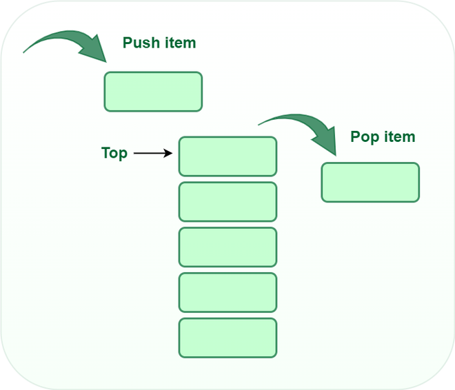

# Stack
## Stacks und Queues

Stacks und Queues sind dynamische Mengen, bei denen das durch die DELETE-Operation aus der Menge entfernte Element vorab festgelegt ist. In einem Stack ist das Element, das aus der Menge gelöscht wird, das zuletzt eingefügte: Der Stack implementiert eine Last-In, First-Out- oder LIFO-Richtlinie. Ebenso ist in einer Queue das zu löschende Element immer dasjenige, das am längsten in der Menge vorhanden war: Die Queue implementiert eine First-In, First-Out- oder FIFO-Richtlinie. Es gibt mehrere effiziente Möglichkeiten, Stacks und Queues auf einem Computer zu implementieren. Hier sehen Sie, wie Sie ein Array mit Attributen verwenden, um sie zu speichern.

**Was ist ein Stack?**
Ein Stack(Stapel) ist eine lineare Datenstruktur, bei der die Einfügung eines neuen Elements und die Entfernung eines vorhandenen Elements am gleichen Ende stattfinden, das als oberes Ende des Stapels repräsentiert wird.

Um den Stapel zu implementieren, muss der Zeiger auf den obersten Teil des Stapels beibehalten werden, der das zuletzt eingefügte Element ist, da wir nur auf die Elemente oben auf dem Stapel zugreifen können.

**LIFO (Last In First Out):**
Diese Strategie besagt, dass das zuletzt eingefügte Element als erstes herauskommt. Ein Beispiel aus dem wirklichen Leben ist ein Stapel von Tellern, die übereinander gestapelt sind. Der Teller, den wir zuletzt daraufgelegt haben, befindet sich oben, und da wir den Teller entfernen, der oben liegt, können wir sagen, dass der Teller, der zuletzt darauf gelegt wurde, als erstes herauskommt.

**Basic Operations on Stack**
Um Manipulationen an einem Stack vorzunehmen, stehen uns bestimmte Operationen zur Verfügung:

- `push()` zum Einfügen eines Elements in den Stack
- `pop()` zum Entfernen eines Elements aus dem Stack
- `top()` Gibt das oberste Element des Stacks zurück
- `isEmpty()` gibt `true` zurück, wenn der Stack leer ist, ansonsten `false`
- `size()` gibt die Größe des Stacks zurück



**Push:**
Fügt ein Element zum Stack hinzu. Wenn der Stack voll ist, tritt ein Overflow-Zustand auf.

**Algorithmus für push:**


**Push:**
Fügt ein Element zum Stack hinzu. Wenn der Stack voll ist, tritt ein Overflow-Zustand auf.

**Algorithmus für push:**
```c
begin
  if stack ist voll
    return
  endif
  else  
    increment top
    stack[top] zuweisen Wert
  end else
end procedure
```

**Pop:**
Entfernt ein Element aus dem Stack. Die Elemente werden in umgekehrter Reihenfolge, in der sie hinzugefügt wurden, entnommen. Wenn der Stack leer ist, tritt ein Underflow-Zustand auf.

**Algorithmen für Pop**

```c
begin
  if stack ist leer
    return
  endif
  else
    Wert von stack[top] speichern
    top dekrementieren
    return Wert
  end else
end procedur
```


**Anwendungen des Stacks:**
- Infix zu Postfix / Präfix Umwandlung
- Rückgängig-Wiederholen-Funktionen an vielen Stellen wie Editoren, Photoshop.
- Vorwärts- und Rückwärtsfunktionen in Webbrowsern
- Verwendet in vielen Algorithmen wie dem Tower of Hanoi, Baumtraversierungen, Aktien-Spannen-Problemen und Histogrammproblemen.
- Backtracking wird verwendet, um Probleme wie das Ritter-Tour-Problem, das Damen-Problem, Labyrinthprobleme und spielähnliche Schach- oder Damesprobleme zu lösen. In all diesen Problemen tauchen wir irgendwie ab. Wenn dieser Weg ineffizient ist, kehren wir zum vorherigen Zustand zurück und gehen einen anderen Weg. Um zum vorherigen Zustand zurückzukehren, müssen wir den vorherigen Zustand in einem Stack speichern.
- In Graphalgorithmen wie topologisches Sortieren und stark zusammenhängende Komponenten
- In der Speicherverwaltung verwendet jeder moderne Computer einen Stack als primäre Verwaltung für einen laufenden Prozess. Jedes Programm, das in einem Computersystem ausgeführt wird, hat seine eigenen Speicherzuweisungen.
- Ein Stack hilft auch bei der Implementierung von Funktionsaufrufen in Computern. Die zuletzt aufgerufene Funktion wird immer zuerst abgeschlossen.

## Übung

### Tower of Hanoi

## Queue

Wir nennen die INSERT-Operation auf einer Warteschlange *ENQUEUE*, und die DELETE-Operation *DEQUEUE*. Ähnlich wie bei der POP-Operation auf einem Stack nimmt *DEQUEUE* kein Elementargument an. Die FIFO-Eigenschaft (First-In, First-Out) einer Warteschlange bewirkt, dass sie wie eine Schlange von Kunden funktioniert, die auf eine Dienstleistung warten. Die Warteschlange hat einen Kopf und einen Schwanz. Wenn ein Element in die Warteschlange eingereiht wird, nimmt es seinen Platz am Ende der Schlange ein, genauso wie ein neu ankommender Kunde seinen Platz am Ende der Linie einnimmt. Das aus der Warteschlange entfernte Element ist immer dasjenige am Kopf der Warteschlange, genau wie der Kunde am Kopf der Linie, der am längsten gewartet hat.


**Eigenschaften einer Warteschlange**

- Warteschlangen können mit mehreren Daten umgehen.
- Der Zugriff ist an beiden Enden möglich.
- Sie sind schnell und flexibel.

**Grundlegende Operationen für eine Warteschlange in der Datenstruktur**

Einige der grundlegenden Operationen für eine Warteschlange in der Datenstruktur sind:

- `Enqueue()` – Fügt ein Element am Ende der Warteschlange hinzu.
- `Dequeue()` – Entfernt Elemente aus der Warteschlange.
- `Peek()` oder `front()` – Greift auf das Datenelement am vorderen Knoten der Warteschlange zu, ohne es zu löschen.
- `Rear()` – Diese Operation gibt das Element am hinteren Ende zurück, ohne es

